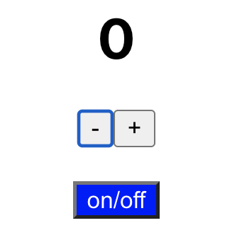

# Explanation for this app.

This is a simple app for testing practice.



As the above image, there is a number 0 at first.
By using + button and - button, you can increase and decrease the number.
When you press on/off button, it disable the + and - buttons and when you press it again, it enable them.

In this app, by using only "getByTestId" like the below example, I completed this app's tests.

```
test("plus button has correct text '+' ", () => {
  render(<App />);
  const plusElement = screen.getByTestId("plus-button");
  expect(plusElement).toHaveTextContent("+");
});
```

# Seven tests implemented by this simple test practice

1. "This counter starts at 0"
2. "minus button has correct text '-' "
3. "plus button has correct text '+' "
4. "when the - button is pressed, the counter changes to -1"
5. "when the + button is pressed, the counter changes to 1"
6. "when the on/off button has blue color, "
7. "prevent the -,+ buttons from being pressed when the on/off button is clicked"
